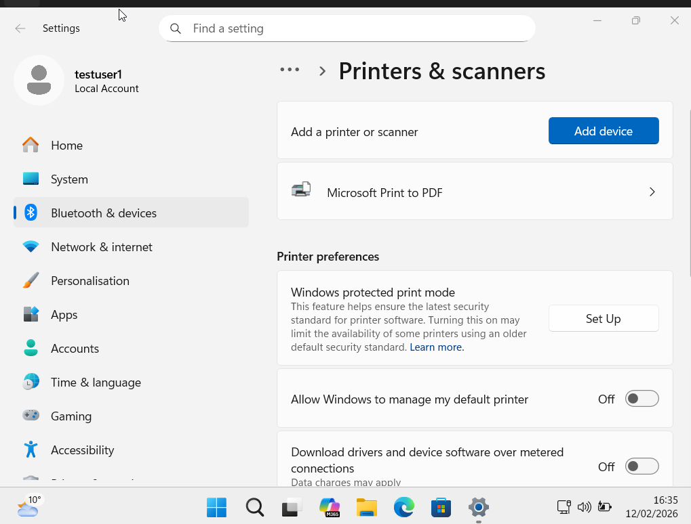
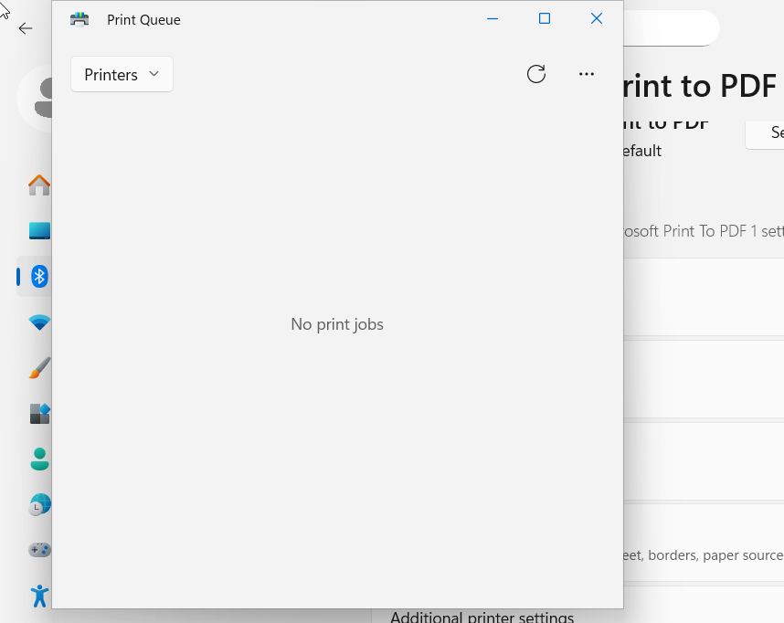
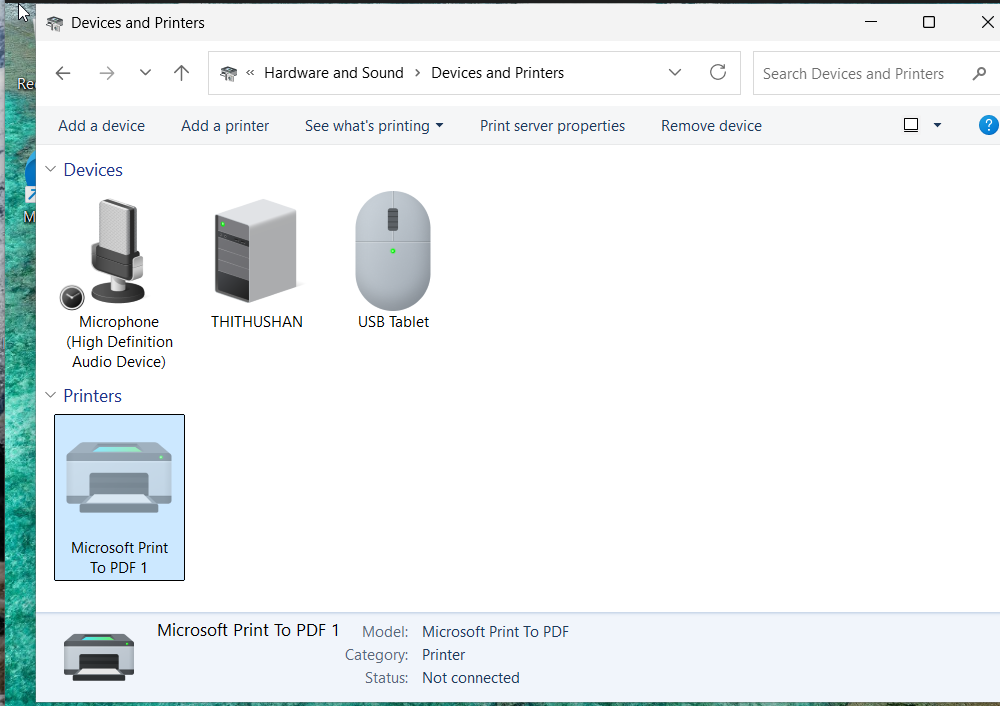
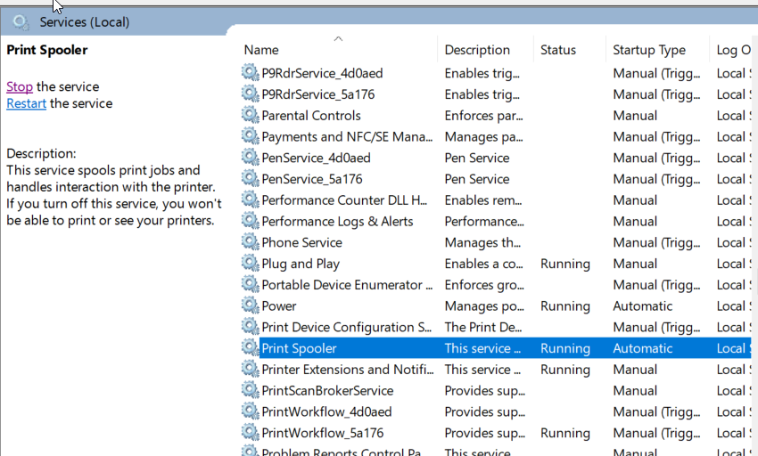
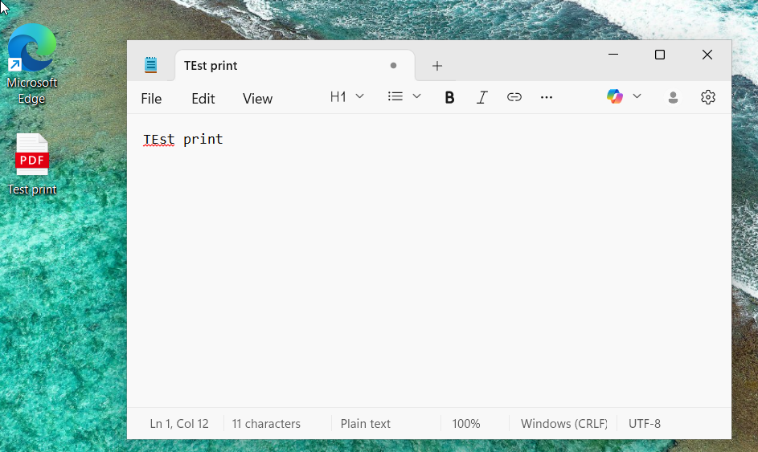

# Ticket-02 — Network Printer Offline (Ticketing Workflow Simulation)

## Ticket Information
- Ticket ID: INC-2002
- Ticket Type: Incident
- Reported By: Finance Department
- Environment: Windows 11 Lab VM
- Date Logged: 12 Feb 2026

---

## Issue Summary
Multiple users reported that the shared office network printer was offline and print jobs were stuck in the queue.

---

## Classification
- Category: Hardware / Network Printing
- Subcategory: Printer Offline

---

## Priority, Severity, SLA
- Priority: P2 (High — Department Impact)
- Severity: Multiple users unable to print
- SLA Target:
  - Response: 1 hour
  - Resolution: 4 hours

---

## Assignment Group
- Assigned To: Tier 1 Service Desk
- Escalation Group: Infrastructure / Print Services Team

---

## Troubleshooting Steps

### 1) Verified User Impact
Confirmed printer showed offline and jobs were stuck.

  
  

---

### 2) Reproduced Issue
Test print job remained stuck.

---

### 3) Admin Investigation
Printer confirmed offline from admin console.

---

### 4) Restarted Print Spooler Service
Restarted spooler to clear service failure.

---

### 5) Cleared Print Queue
Removed stuck spool files.

---

### 6) Restored Printer Online Status
Disabled “Use Printer Offline”.

---

### 7) User Validation
Test print succeeded.

---

## Root Cause
Print Spooler service interruption caused the network printer to enter offline state and queue jobs failed to process.

---

## Resolution
- Restarted Print Spooler
- Cleared stuck print queue
- Restored printer online status
- Validated successful printing

---

## Escalation Decision
Escalation not required — resolved at Tier 1 within SLA.

---

## Ticket Status
**Closed — Resolved**
